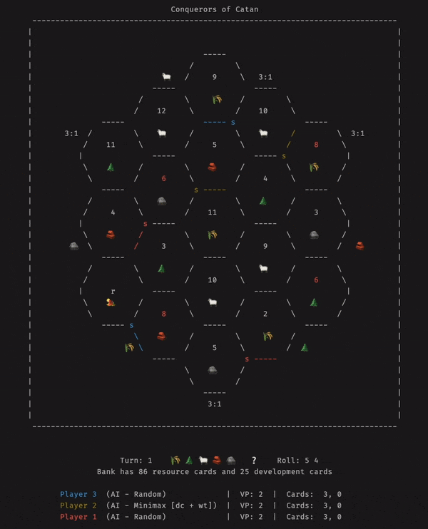

<div align="center">

# Conquerors of Catan
### A Settlers of Catan AI Project

&nbsp; 🌾 &nbsp; 🌲&nbsp; 🐑&nbsp; 🧱 &nbsp; 🪨  &nbsp; &nbsp; &nbsp; ❔

© 2023 HARRISON PHILLINGHAM

</div>

---

## Contents

- [Introduction](#introduction)
- [Getting Started](#getting-started)
- [Playing the Game](#playing-the-game)
- [Game Grid System](#game-grid-system)
- [Contact and Licence](#contact-and-licence)

## Introduction

The Settlers of Catan (Settlers) is a classic board game that provides a unique and interesting challenge to modern AI methods, such as those found in AlphaGo. In Settlers, players build and develop roads, settlements and cities on a board of resource tiles, scoring them Victory Points of which they need 10 to win. However, the challenge of making an AI player for this comes from multiple factors, including imperfect information, elements of chance and negotiation, and having more than 2 players. In this project, I aim to first produce a fully-playable command line version of the game, and then create a strong AI player with multiple strategies that can be investigated and compared, aiming for human-competitive level or better.

## Demo



## Getting Started

### ❗ Notes

> This program requires Python 3.10 or later to run.
>
> The program is fully tested and compatible with Mac Systems. However, Windows systems may struggle as the emojis and colours of players are not displayed properly. The core game still functions, it is just the display that is affected.
>
> The game has been bug tested, and full games to the end are possible. However, due to the time complexity of playing a full game and finding all bugs, there may still be a few issues in there. For example, some actions cannot be cancelled while chosen. Some inputs may also crash the program, though this is quite rare.

### Starting the Game

In order to run the game, you first need to install the dependencies. This can be done by running the following command:

```pip install -r requirements.txt```

After the dependencies are installed, you can run the program by running the following command:

```cd ./src && python3 __main__.py``` or ```python3 src```

(You may need to change `python3` to `python` depending on your system)

If the program fails to run and states missing dependencies, or performs incorrectly, please try adding the extra requirements in from `requirements.txt`. These shouldn't be necessary, but in some situations may fix some problems.

## Playing the Game

The game can be played with or without a Human Player. Games without human players are played at a faster speed, and are used to observe the AI player's actions.

The game players and options can be configured in the menu when the game begins. The default is one human player, two random players, and one MiniMax player.

Game play happens in turns. On each turn, the player rolls the dice, and then performs one or move of the following actions (in this order):
- Trading with the bank
- Purchasing a development card
- Building a settlement, city or road.

These interactions are automated for the AI players, but the human player is prompted to make a choice and told how to do so. All interactions for humans happen in the terminal.

The overall aim is to be the first player to reach 10 victory points. Points are scored as follows:
- 1 point for each settlement
- 2 points for each city
- 1 point for each development card of the type "Victory Point"
- 2 points for having the longest road
- 2 points for having the largest army

## Game Grid System

The board uses letters and grid references to identify the different tiles and vertices on the board. The tiles are lettered in alphabetic order from top to bottom, left to right. The vertices are labeled with each letter that they are adjacent to, and then a number indicating their position. For example, the top most tile is 'a' and has vertices 'a1' and 'a2' for the two vertices in the ocean. Continuing clockwise, it then has 'a,c', 'a,c,e', 'a,b,e' and 'a,b'.


## Contact and Licence

If you have any questions, please feel free to contact me at [harrison@phillingham.com](mailto:harrison@phillingham.com)

This code is released under the GPLv3 licence, which can be found in the LICENCE file in the root of this repository.
